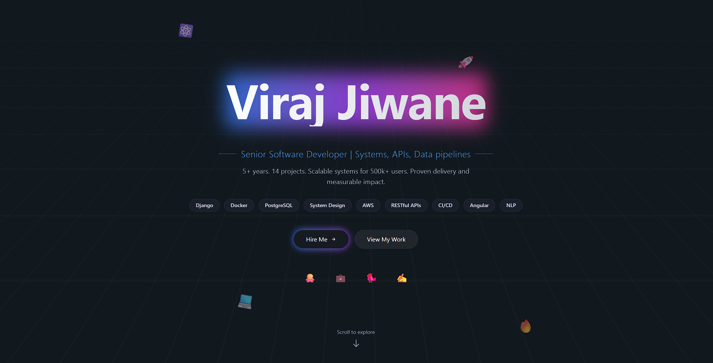

# 👋 Hi, I'm **Viraj Jiwane**

💻 **Senior Software Developer** | 5+ years of experience building scalable, production-grade systems across backend and full-stack environments.

I design and deliver clean, modular, and efficient solutions using **Angular, Python, Django, Spring Boot, Node.js, and Docker** — driven by performance, precision, and clarity.

---

## 🧭 Portfolio

Check out my live portfolio to explore projects, designs, and open-source work:  
🔗 **[virajjiwane.onrender.com](https://virajjiwane.onrender.com)**  
💻 **Source:** [github.com/virajjiwane/whoami](https://github.com/virajjiwane/whoami)

You’re free to **use or fork the code** for your own portfolio.  
All personal data (name, bio, projects, etc.) can be edited in: `src/app/services/data.ts`

---

## 🧰 Tech Stack

**Languages:** Python, JavaScript, Java, TypeScript  
**Frameworks:** Angular, Django, Spring Boot, Express  
**Databases:** PostgreSQL, MySQL  
**Tools:** Docker, AWS, Git, CI/CD  
**Concepts:** System Design, Microservices, REST APIs, Cloud Architecture  

---

## 🧩 Recent Work

- **Euracle Corp. (EDA Inc.)** — Scalable analytics pipelines, performance improvements (85%), GDPR-compliant dashboards.  
- **LenDenClub** — Led microservice-based lending platform; reduced disbursal time by 98%, mentored 6 developers.  
- **Amdocs** — Contributed to orchestration layer modernization and test automation.  

---

## 🧠 Highlights

- 🧾 **Patent Holder (SILI Tool, 2024)**  
- 🏆 **Hackathon Winner (Springer, 2020)**  
- 🏅 **SPOT Award (2022)**  
- 📚 **Published Paper (Springer, 2020)**  
- 🎓 **B.E. Computer Engineering, MIT Pune**  

---

## ⚡ Open Source Portfolio Template

If you’d like to use my portfolio as a starting point:

1. Fork this repo → [github.com/virajjiwane/whoami](https://github.com/virajjiwane/whoami)  
2. Update `src/app/services/data.ts` with your own info  
3. Deploy it easily on [Render](https://render.com) or [Netlify](https://www.netlify.com/)

---

## 🧡 Support the Work

If my projects or code helped you:

- ⭐ **Star** the repos you like  
- 💬 Share feedback or ideas  
- 🔗 Connect on [LinkedIn](https://www.linkedin.com/in/viraj-jiwane-33aa2b126/)  

---

## 📬 Contact

📧 **vjiwane27@gmail.com**  
🌐 [virajjiwane.onrender.com](https://virajjiwane.onrender.com)  
🐙 [github.com/virajjiwane](https://github.com/virajjiwane)  
💼 [LinkedIn](https://www.linkedin.com/in/viraj-jiwane-33aa2b126/)  

---

